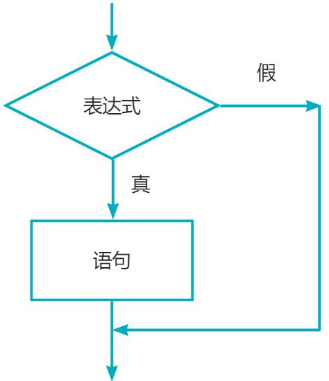

# 2-1. 单行 `if`

### 程序流程结构

C/C++ 支持最基本的三种程序运行结构：**顺序结构**, **选择(分支)结构**, **循环结构**

- **顺序结构**: 从上到下，从前往后执行
- **选择结构 (分支结构)**: 依据条件是否满足，**有选择**地执行相应功能
- **循环结构**: 依据条件是否满足，循环**多次**执行代码

#### 选择结构 - `if` 语句

如图:



1. 单行格式的 `if` 语句

```cpp
if (条件) {
    条件满足时执行的语句
}
```

<!-- !> 注意缩进一个 Tab 位 -> 不需要 你写一行都行 -->

### 代码示例

```cpp
#include <iostream>
using namespace std;
int main()
{
    int score;
    cout << "请输入一个分数: ";
    cin >> score;
    if (score > 700)
    {
        // 注意里面的代码缩进一个tab位
        cout << "恭喜你，你能考上清华或北大" << endl;
    }
    cout << "score = " << score << endl;
    return 0;
}
```

```output
> 请输入一个分数: 
< 600
> score = 600
```

```output
> 请输入一个分数: 
< 750
> 恭喜你，你能考上清华或北大
> score = 750
```