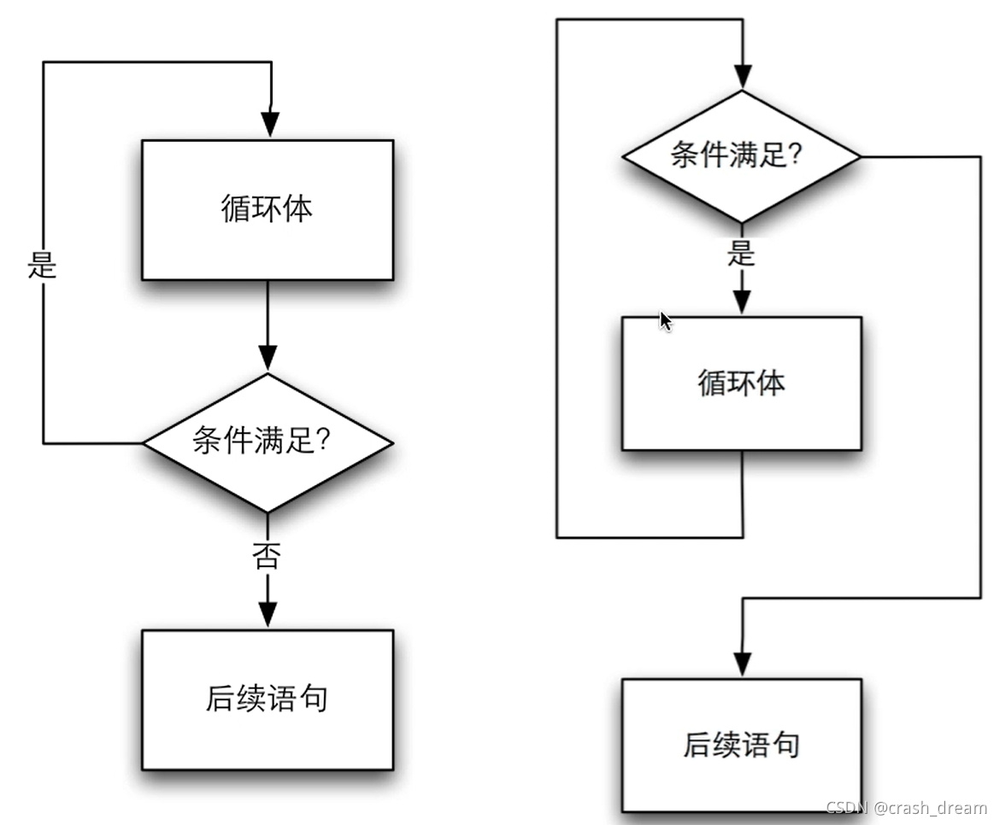

# 3-3. do-while 循环

**作用**: 满足循环条件.执行循环语句

语法:

```cpp
do {
    循环语句; // 循环体
} while (循环条件);
```

!> 不要忘了 `while(...)` 末尾的 `;`*(分号)* !!!

### `do-while` 与 `while` 的不同点

- `while`: 先**判断**再**执行**
- `do-while`: `先**执行**再**判断**
- 这意味着 `do-while` 即使条件*不成立也会执行一次*
- 而 `while` 则*不会*

如图 (*左*为 `do-while` / *右*为 `while`):

