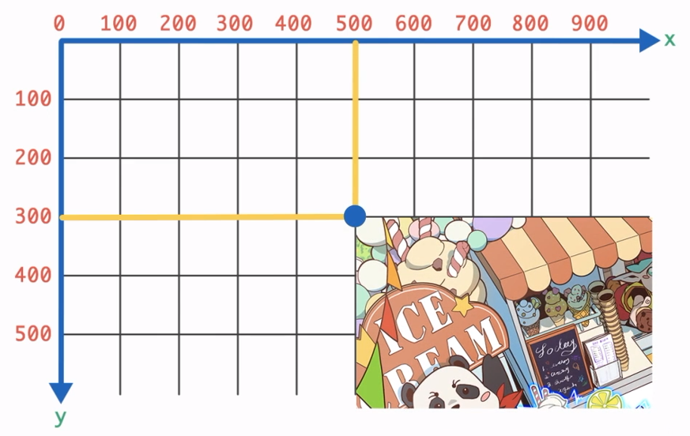
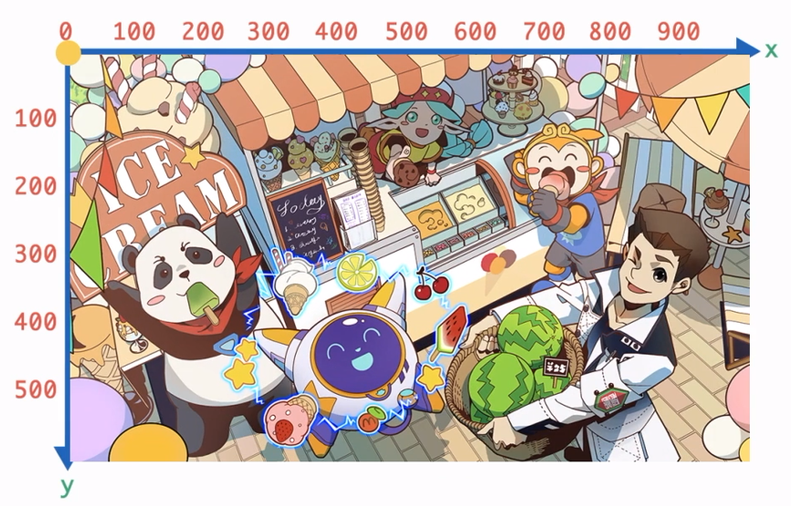

# 1. 初识 Pygame

## 什么是游戏

游戏一般由四个基础要素组成：

- 目标: 需要完成的某些任务
- 阻碍：达到目的必须克服的事情
- 决策：跨越阻碍的方法
- 规则：玩家在游戏中做的所有事都需要遵循的规矩

## Pygame 库

Pygame 库是一个第三方的 Python 游戏开发库

使用 `pip` 安装:

```shell
pip install pygame
```

### 最小开发框架

即 Pygame 最基础的代码，每一个使用 Pygame 的游戏都是在此基础上搭建

```py
import sys
import pygame

pygame.init()
screen = pygame.display.set_mode((400, 600))

# ↑ 1 部分 / ↓ 2 部分

while True:
    for event in pygame.event.get():
        if event.type == pygame.QUIT:
            sys.exit()

    pygame.display.update()
```

#### 1 部分

称为 `初始化模块`

可能执行下面的操作：

- 创建窗口
- 加载资源 *(图片/音乐等)*
- 初始化数值
- ...

```py
import sys # 导入 sys 库 (全名 system 系统)，用来使用它的 exit() 方法退出程序
import pygame # 导入 Pygame

pygame.init() # 初始化 Pygame
screen = pygame.display.set_mode((400, 600)) # 创建游戏窗口 (宽 400，高 600) -> 存放到变量 screen 中
# 注意：set_mode() 需要传入一个包含宽和高的元组，表现为双层小括号
```

#### 2 部分

称为 `主循环模块`

```py
while True:
    for event in pygame.event.get(): # 获取事件
        if event.type == pygame.QUIT: # 如果检测到关闭窗口
            sys.exit() # 退出程序

    pygame.display.update() # 重绘界面
```

### 显示图片

显示图片有两个步骤：

- 加载图片 (初始化模块)
- 绘制图片 (主循环模块)

#### 加载图片

使用:

```py
var = pygame.image.load(path)
```

- `path`: 图片的路径 (字符串)
- `var`: 用来存储图片的变量
 
如:

```py
bg = pygame.image.load('pic/背景.png')
# bg: background 背景
```

#### 绘制图片

使用:

```py
screen.blit(img, xy)
# ↓
screen.blit(img, (x, y))
```

- `img`: 存储图片的变量
- `(x, y)`: 一组坐标，决定图片绘制的位置

#### 坐标系

Pygame 的坐标系与 Turtle 库不同，**原点在左上角**

```
A ---------→ x
|
|
|
|
↓
y
```

此处的 `A` 点即为原点 *(`0`, `0`)*

其中，越往右横坐标越大 (`x` 轴)，越往下纵坐标越大 (`y` 轴)



如上图，其中 `0` 处为原点，蓝点的横坐标为 `500`，纵坐标为 `300`，它的坐标即为 `(500, 300)`

?> 在显示图片时，指定的坐标是**图片左上角的坐标**

> 即：如下图，如果需要让图片铺满屏幕，只需将坐标指定为 `(0, 0)`即可 ↓



```py
screen.blit(bg, (0, 0))
```

### 播放音乐

步骤类似于显示图片：

- 加载音乐
- 播放音乐

> 因为背景音乐一般是重复循环播放，所以可以直接放在初始化模块中

#### 加载

使用:

```py
pygame.mixer.music.load(path)
```

- `path`: 音乐文件的路径

#### 播放

使用:

```py
pygame.mixer.music.play(arg)
```

- `arg`: 设为 `-1` 代表无限循环播放 ~~*(类型/循环次数?)*~~

## End

本课学习了:

1. Pygame 最小开发框架
  - 初始化模块
  - 主循环模块
2. 添加图片和音乐